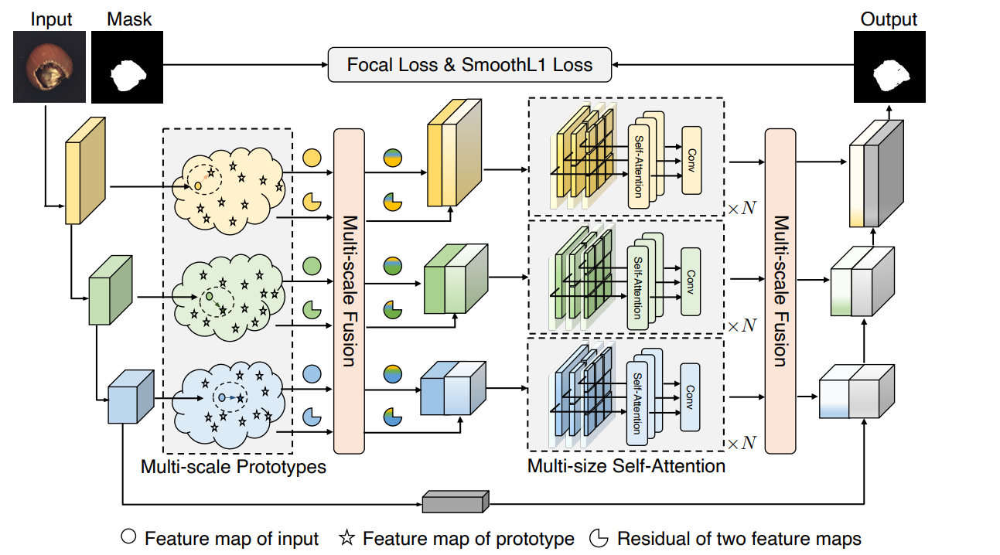

# [Prototypical Residual Networks for Anomaly Detection and Localization](https://openaccess.thecvf.com/content/CVPR2023/papers/Zhang_Prototypical_Residual_Networks_for_Anomaly_Detection_and_Localization_CVPR_2023_paper.pdf)

Unofficial PyTorch implementation for CVPR2023 paper, Prototypical Residual Networks for Anomaly Detection and Localization.

This paper proposes a framework called Prototypical Residual Network (PRN), which learns feature residuals of varying scales and sizes between anomalous and normal patterns to accurately reconstruct the segmentation maps of anomalous regions.


---


## Dataset Preparation

Download MVTecAD dataset from [there](https://www.mvtec.com/de/unternehmen/forschung/datasets/mvtec-ad/), put it to the directory ``data/mvtec_anomaly_detection``.

Then unzip the foreground masks:
```
unzip fg_mask.zip
```

## Prototype Features Generation

Run the `create_proto_feature_maps.py` to generate prototype features.
```
python create_proto_feature_maps.py
```

## Training and validating

Run the following code for training and validating the MVTecAD dataset.
```
python train.py
```

We summarize the validation results on MVTecAD as follows.


| Category | Image/Pixel AUC | Paper | 
|:------------:|:--------:|:----------:|
| Carpet | 0.999/0.988 | 0.977/0.990 | 
| Grid | 0.818/0.830 | 0.994/0.984 | 
| Leather | 1.000/0.994 | 1.000/0.997 | 
| Tile | 0.992/0.957 | 1.000/0.996 | 
| Wood | 1.000/0.955 | 1.000/0.978 | 
| Bottle | 1.000/0.984 | 1.000/0.994 | 
| Cable | 0.952/0.949 | 0.989/0.988 | 
| Capsule | 0.903/0.961 | 0.980/0.985 | 
| Hazelnut | 1.000/0.994 | 1.000/0.997 | 
| Metal Nut | 0.962/0.984 | 1.000/0.997 | 
| Pill | 0.880/0.970 | 0.993/0.995 | 
| Screw | 0.834/0.961 | 0.959/0.975 | 
| Toothbrush | 0.983/0.963 | 1.000/0.996 | 
| Transistor | 0.931/0.973 | 0.997/0.984 | 
| Zipper | 0.988/0.960 | 0.997/0.988 | 
| Mean | 0.949/0.962 | 0.994/0.990 |
---


## :hammer: Todo List

The following issues need to be further improved:

- [x] Update the dataset code. Current data processing way is not fully consistent with the description in the paper.
- [X] Address the problem of unstable results during training. The loss is stable but the validation results are unstable.
 
## Reference

```
@InProceedings{Zhang_2023_CVPR,
    author    = {Zhang, Hui and Wu, Zuxuan and Wang, Zheng and Chen, Zhineng and Jiang, Yu-Gang},
    title     = {Prototypical Residual Networks for Anomaly Detection and Localization},
    booktitle = {Proceedings of the IEEE/CVF Conference on Computer Vision and Pattern Recognition (CVPR)},
    month     = {June},
    year      = {2023},
    pages     = {16281-16291}
}
```


## Acknowledgement

The dataset part of this repository is built using the [BGAD](https://github.com/xcyao00/BGAD) library and the [DRAEM](https://github.com/VitjanZ/DRAEM) repository.